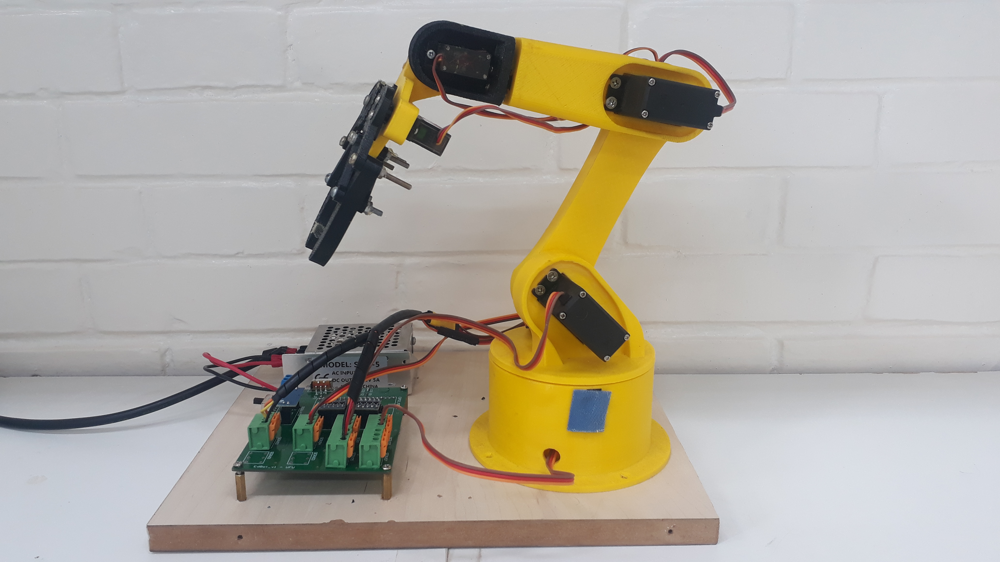

# edbot

This project aims the development of a robotics platform for educational use in undergraduate courses. 
In the study of robotics, it is easy to observe the benefits of the use of simulations that allow an application of theoretical concepts, 
in addition to the use of equipment that allows analyzing the influence of the various variables present in the real world. 
Therefore, this project presents the development of central software with a graphical interface, the elaboration of the connection of this
software with the simulation program V-REP and the construction of a physical robot controlled by an embedded board that communicates 
with the central software using the protocol MQTT.

The software was developed in Python language using the PyQt5 library to build the graphical interface. 
The embedded system was designed to use an ESP32 module, which drives the servomotors to move the robot and enables communication with the
software using MQTT. The firmware for the ESP32 chip was developed in C/C++ using the Arduino framework. 
In this way, it is possible to observe the development of a very comprehensive platform, which can help in robotics studies and the 
development of future applications.

